# 🏠 O2O-Demand-Forecasting-Solution

> **오늘의집 O2O 서비스팀** | 부동산 거래 데이터 기반 인테리어 수요 예측 파이프라인

---

## 대시보드 미리보기

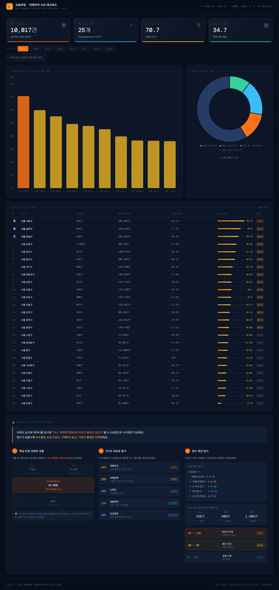

---

## 기능별 스크린샷

### KPI 카드 — 핵심 지표 한눈에

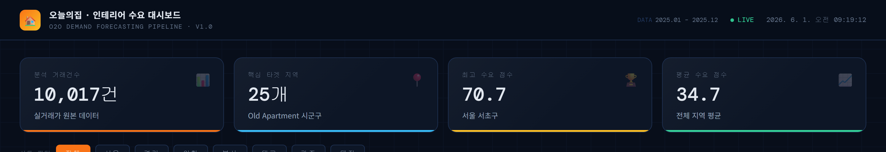

분석 거래건수 · 핵심 타겟 지역 수 · 최고/평균 수요 점수를 실시간으로 표시합니다.

---

### 차트 — 지역별 수요 점수 시각화

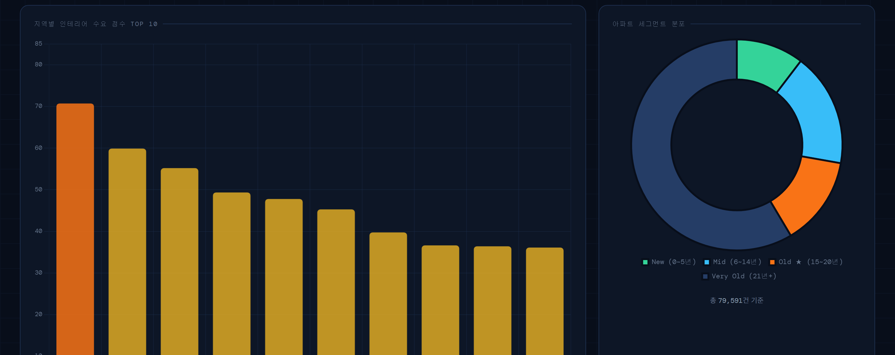

- **바 차트**: TOP 10 지역의 수요 점수 (S등급 주황, A등급 노랑, B등급 파랑)
- **도넛 차트**: 전체 79,591건의 아파트 세그먼트 분포

---

### 수요 점수 랭킹 테이블

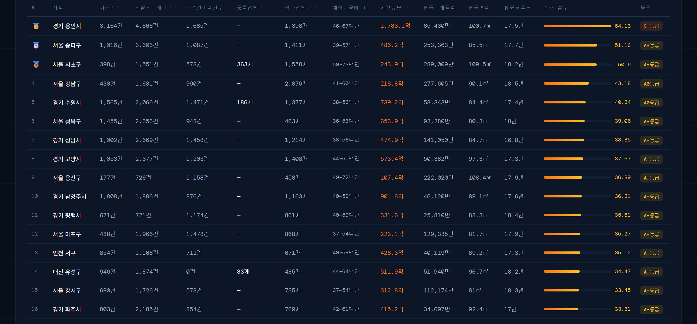

시군구별 거래건수 · 평균거래금액 · 평균노후도 · 수요 점수 · S/A/B 등급에, 등록업체수·상가업체수·
예상시공비·시장규모 등 정보성 컬럼까지 한 테이블에서 확인합니다.

---

### 지역별 수요 점수 지도 — 2가지 보기 모드

<table>
<tr>
<td width="50%">

**수요 등급 모드**

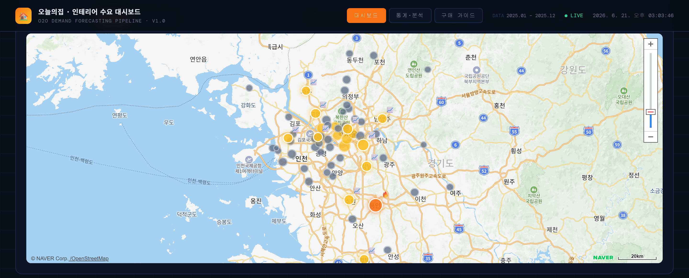

S/A/B 등급별 색상 마커 + 거래량 상위 25%·S/A등급 하이라이트(🔥 불장 / 📈 상승세)

</td>
<td width="50%">

**시장규모·시공비 모드**

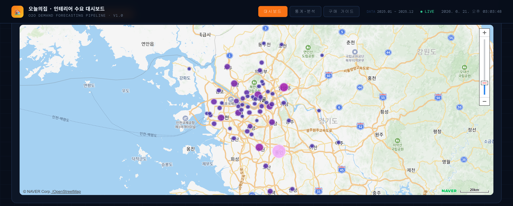

시장규모 추정(억 원)에 따라 보라→마젠타→핑크 그라데이션 색상·크기로 마커 표시, 클릭 시
예상 시공비 범위까지 확인

</td>
</tr>
</table>

헤더의 토글 버튼으로 두 모드를 전환합니다. 마커 클릭 시 인포윈도우에는 모드와 무관하게
거래건수·노후도·업체수·예상시공비·시장규모 등 전체 지표가 표시됩니다.

---

### 시도 필터 + 지역 검색

<table>
<tr>
<td width="50%">

**서울 필터 적용**

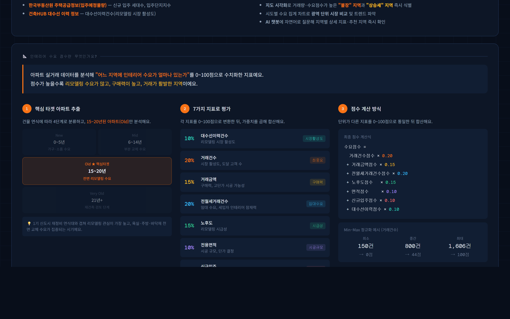

시도 버튼으로 원하는 광역시/도만 필터링합니다.

</td>
<td width="50%">

**지역 검색 (서초)**

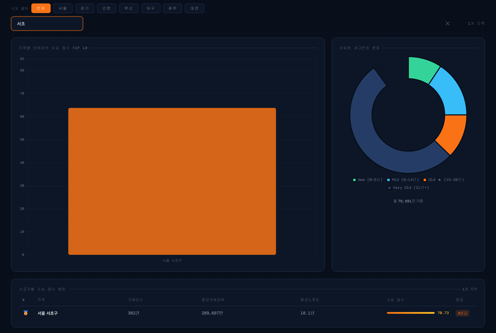

지역명을 입력하면 해당 지역만 필터링해서 보여줍니다.

</td>
</tr>
</table>

---

### 단지명 검색

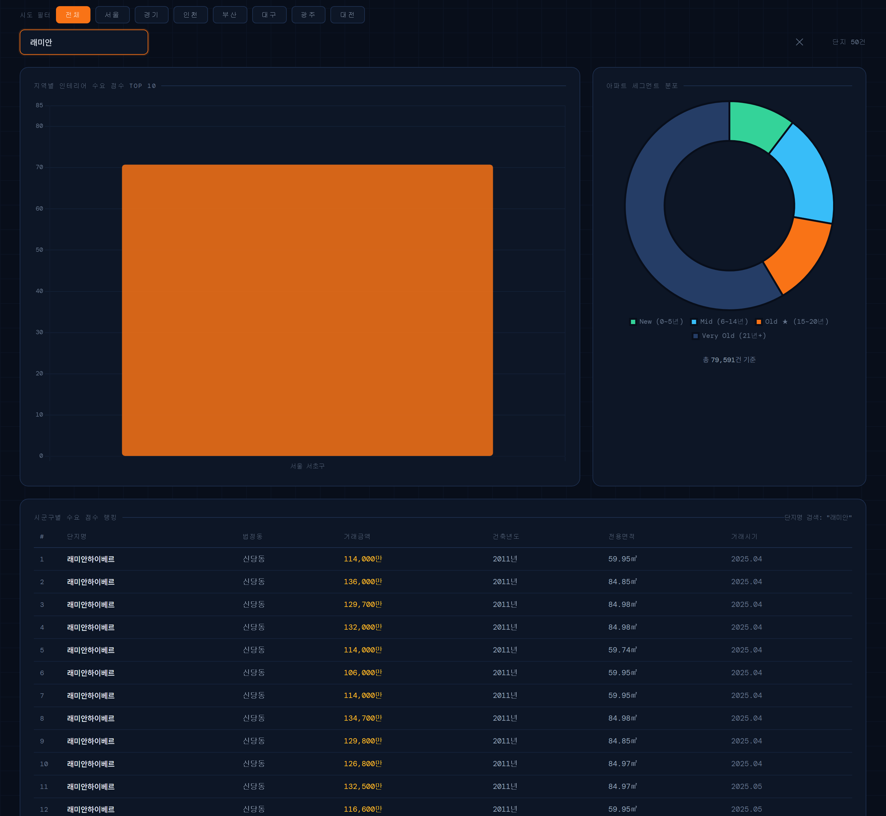

아파트 단지명으로 검색하면 원본 실거래 데이터에서 해당 단지의 거래 이력을 조회합니다.

---

### 인테리어 수요 점수 산출 방식

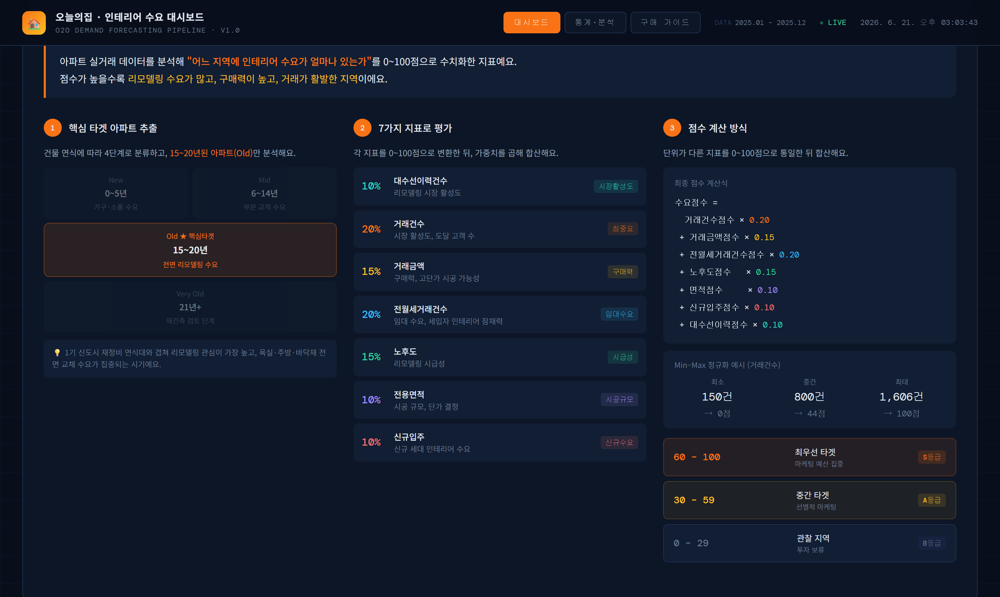

점수 계산의 3단계(핵심 타겟 추출 → 5가지 지표 평가 → Min-Max 정규화 합산)와 S/A/B 등급 해석 가이드를 제공합니다.

---

## 프로젝트 개요

국토교통부 **아파트 매매·전월세 실거래가**, 한국부동산원 **입주예정물량**, 건축HUB **대수선 이력**
데이터를 결합해 시군구별(서울·경기·인천·5대 광역시 총 102개) **인테리어 수요 점수(0~100점)**를
산출하는 분석 파이프라인입니다.

공공데이터 API를 연결하여 **자동 수집 → 분석 → 대시보드 갱신**까지 end-to-end로 동작하며,
산출 결과는 Flask 기반 대시보드(랭킹/차트/네이버 지도)와 LLM 챗봇(Ollama)으로 제공됩니다.
또한 사회초년생·첫 집 구매자를 위한 **"구매 가이드" 탭**(절차 안내 + 전용 가이드 챗봇)도 함께 제공합니다.

---

## 🏗️ 아키텍처

### 프로젝트 구성도

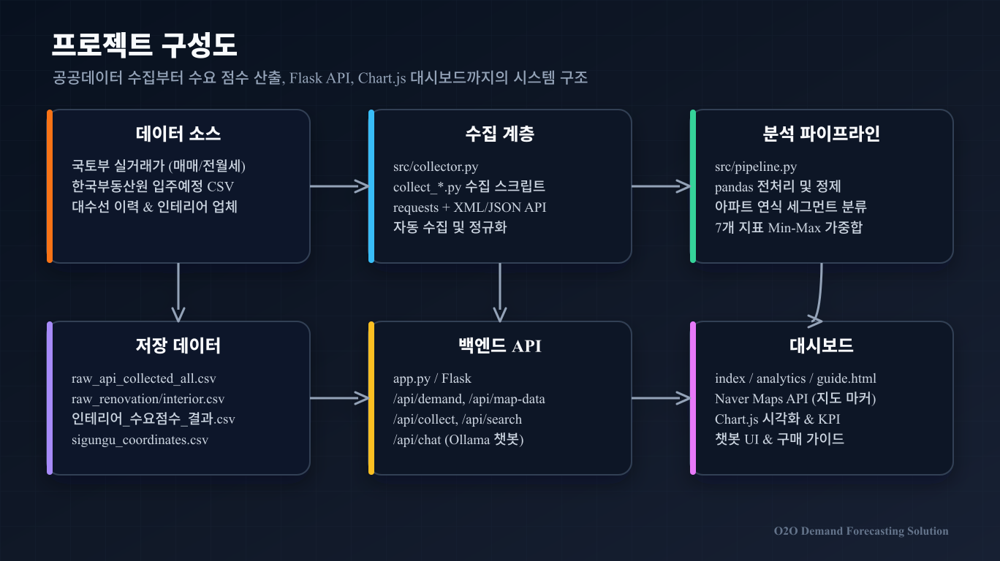

데이터 소스(국토교통부 실거래가 API, 한국부동산원 입주예정 CSV) → 수집 계층(`src/collector.py`) →
분석 파이프라인(`src/pipeline.py`) → 백엔드 API(`app.py`) → 대시보드(`templates/index.html`)로
이어지는 전체 시스템 구조입니다.

### 데이터/ML 흐름도

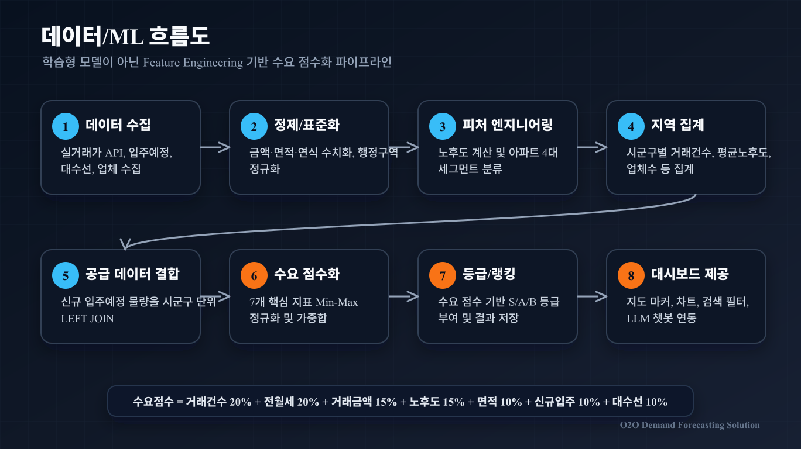

데이터 수집 → 전처리 → Feature Engineering(노후도, 세그먼트 분류) → 지표 집계 → 공급 데이터 결합 →
수요 점수 산출(Min-Max 정규화 + 가중합) → 등급 산정(S/A/B) → 대시보드 제공까지의 흐름입니다.

---

## 📁 프로젝트 구조

```
O2O-Demand-Forecasting-Solution/
│
├── data/
│   ├── 아파트(매매)_실거래가_20260311170739.csv            # 국토부 실거래가 (초기 입력용)
│   ├── 한국부동산원_주택공급정보_입주예정물량정보_20251231.csv  # 입주예정 (초기 입력용)
│   ├── raw_api_collected_all.csv                 # 매매 실거래가 API 수집 결과 (서울·경기·인천 + 5대 광역시)
│   ├── raw_rent_collected_all.csv                # 전월세 실거래가 API 수집 결과 (서울·경기·인천 + 5대 광역시)
│   ├── raw_renovation_collected.csv              # 건축HUB 대수선 이력 수집 결과
│   ├── raw_interior_companies.csv                # 전국인테리어업체표준데이터 수집 결과
│   ├── raw_sbiz_interior_stores.csv              # 소상공인 상가정보 기준 인테리어 관련 상가 수 집계 결과
│   ├── sigungu_coordinates.csv                   # 102개 시군구 중심 좌표 (네이버 지도 마커용)
│   ├── 인테리어_수요점수_결과.csv                  # 파이프라인 실행 결과 (시군구별, 102개)
│   ├── 시도별_수요집계_요약.csv                    # 파이프라인 실행 결과 (시도별 요약)
│   └── chat_history.db                           # 챗봇 질문/응답 기록 (SQLite, chat_type으로 구분, git 제외)
│
├── notebooks/
│   ├── 01_EDA_and_Hypothesis.ipynb               # 탐색적 데이터 분석
│   ├── 02_Pipeline_and_DemandScore.ipynb         # 파이프라인 실행 & 수요 점수 시각화
│   ├── 03_API_Collection.ipynb                   # API 수집 & 파이프라인 실행
│   └── 04_TimeSeries_Forecasting.ipynb           # 월별 거래량 시계열 예측 (SARIMA/Prophet/LightGBM 비교)
│
├── src/
│   ├── collector.py                              # ★ 공공데이터 API 자동 수집 모듈 (매매/전월세/대수선/인테리어업체)
│   ├── pipeline.py                               # ★ 인테리어 수요 점수 산출 파이프라인 (7개 지표)
│   └── log_design.py                             # 로깅 유틸리티
│
├── collect_metro5.py                             # 5대 광역시 데이터 수집 + 파이프라인 재실행 스크립트
├── collect_renovation.py                         # 대수선 이력 수집 스크립트
├── collect_interior_companies.py                 # 인테리어업체 데이터 수집 스크립트 (활용신청 필요)
├── collect_interior_stores.py                    # 소상공인 상가정보 기반 인테리어 관련 상가 수집 스크립트 (활용신청 필요)
├── analyze_timeseries.py                         # 월별 거래량 SARIMA/Prophet/LightGBM 비교 스크립트 → timeseries_forecast_result.json 생성
│
├── templates/
│   ├── index.html                                # 메인 대시보드 (소개 카드, 지도, 랭킹, 챗봇)
│   ├── analytics.html                            # 통계·분석 2페이지 (차트/테이블 모음)
│   ├── forecast.html                             # 수요 예측 탭 (SARIMA/Prophet/LightGBM 비교)
│   └── guide.html                                # 구매 가이드 탭 (절차 안내 + 가이드 전용 챗봇)
│
├── app.py                                        # ★ Flask 웹 서버 (대시보드 + API + 챗봇 2종)
│
├── docs/                                         # 아키텍처 / ML 파이프라인 다이어그램
├── screenshots/                                  # 대시보드 스크린샷
├── devlog/                                       # 날짜별 개발 일지 (로컬용, git 제외)
│
├── venv/                                         # 가상환경 (git 제외)
├── .env                                          # API 키 등 환경변수 (git 제외)
├── .env.example                                  # 환경변수 템플릿
├── .gitignore
├── requirements.txt
└── README.md
```

---

## ⚙️ 환경 세팅

### 1. 가상환경 생성 및 활성화

```powershell
# 가상환경 생성
python -m venv venv

# 최초 1회 — PowerShell 실행 정책 허용
Set-ExecutionPolicy -ExecutionPolicy RemoteSigned -Scope CurrentUser

# 활성화 (작업 시작할 때마다 실행)
venv\Scripts\activate
```

터미널 앞에 `(venv)` 가 붙으면 성공입니다.

### 2. 패키지 설치

```powershell
pip install -r requirements.txt
```

> **Python 3.14 사용 시 주의**  
> pandas 2.x 는 3.14 미지원 → `pandas>=3.0` 이 자동 설치됩니다.

---

## 🔑 API 키 설정

### 공공데이터포털 API 신청

1. [data.go.kr](https://www.data.go.kr) 로그인
2. **"국토교통부\_아파트 매매 실거래가 상세 자료"** 검색 → 활용신청
   - 직접 링크: https://www.data.go.kr/data/15126468/openapi.do
   - 심의유형: 자동승인 (즉시 사용 가능)
   - → `.env`의 `API_KEY`에 사용 (실거래 데이터 수집용)
3. (선택) **"국토교통부\_공동주택 기본정보제공 서비스"** 검색 → 활용신청
   - → `.env`의 `APT_BASIC_INFO_API_KEY`에 사용 (단지코드·세대수 등 기본정보 조회용)
4. (선택) **"전국인테리어업체표준데이터"** 검색 → 활용신청
   - 직접 링크: https://www.data.go.kr/data/15102725/openapi.do
   - → `.env`의 `INTERIOR_API_KEY`(없으면 `API_KEY`로 폴백)에 사용 (`collect_interior_companies.py`)
5. (선택) **"소상공인시장진흥공단_상가(상권)정보"** 검색 → 활용신청
   - 직접 링크: https://www.data.go.kr/data/15012005/openapi.do
   - → `.env`의 `SBIZ_API_KEY`(없으면 `API_KEY`로 폴백)에 사용 (`collect_interior_stores.py`)
6. 마이페이지 → 인증키 관리 → **일반 인증키(Decoding)** 복사

> ⚠️ **키 보안 주의사항**  
> 인증키를 코드나 GitHub에 직접 입력하지 마세요.  
> `.env` 파일에 보관하고 `.gitignore`에 추가하세요.  
> 같은 디코딩 키를 두 서비스 모두에서 사용해도 되지만, **서비스별로 별도 "활용신청"** 이 필요합니다.

`.env.example`을 복사해서 `.env`를 만들고 키 값을 채워주세요.

```powershell
copy .env.example .env
```

```
# .env 파일 예시
# 1) 아파트매매 실거래 상세자료 - 거래 데이터 수집용
API_KEY=여기에키값

# 2) 공동주택 기본정보제공 서비스 - 단지 기본정보(단지코드, 세대수 등) 조회용
APT_BASIC_INFO_API_KEY=여기에키값

# 로컬 Ollama 설정 (선택)
OLLAMA_HOST=http://localhost:11434
CHAT_MODEL=qwen2.5:3b
```

### API 연결 테스트

```powershell
python src/collector.py 일반인증키값
```

성공 시 출력:
```
[TEST] 서초구 / 202602 단건 수집
  수집 건수: 84건
[NORMALIZE] 변환 후 컬럼: ['시군구', '단지명', '전용면적(㎡)', ...]
  시군구                단지명     거래금액(만원)  건축년도
  서울특별시 서초구 서초동  현대슈퍼빌  270,000    2003
```

---

## 🚀 사용법

### 데이터 수집 (API 자동 수집)

```python
from src.collector import (
    ApartmentDataCollector,
    SEOUL_SIGUNGU_CODES, GYEONGGI_SIGUNGU_CODES, INCHEON_SIGUNGU_CODES,
)

collector = ApartmentDataCollector(api_key="일반인증키값")

# 최근 12개월 서울 전체 수집 후 CSV 저장
df = collector.fetch_recent_months(
    months=12,
    save_path="data/raw_api_collected.csv"
)

# 서울 + 경기 + 인천 전체(77개 시군구) 수집
all_codes = {**SEOUL_SIGUNGU_CODES, **GYEONGGI_SIGUNGU_CODES, **INCHEON_SIGUNGU_CODES}
df = collector.fetch_recent_months(
    sigungu_codes=all_codes,
    months=12,
    save_path="data/raw_api_collected.csv"
)
```

### 파이프라인 실행

```python
from src.pipeline import DemandForecastingPipeline

pipeline = DemandForecastingPipeline(
    transactions_path="data/아파트(매매)_실거래가_20260311170739.csv",
    supply_path="data/한국부동산원_주택공급정보_입주예정물량정보_20251231.csv",
)

df_result, sido_summary = pipeline.run()
```

### 가중치 커스터마이징

```python
# 예: 신규 입주 수요 중심 전략으로 변경
pipeline = DemandForecastingPipeline(
    transactions_path="...",
    supply_path="...",
    score_weights={
        "거래건수": 0.25,
        "거래금액": 0.20,
        "노후도":   0.15,
        "면적":     0.10,
        "신규입주": 0.30,  # 가중치 상향
    }
)
```

---

## 🌐 웹 대시보드 실행 (Flask)

### 서버 실행

```powershell
python app.py
```

서버가 실행되면 브라우저에서 `http://localhost:8300` 으로 접속하면 대시보드가 표시됩니다.

> `/api/collect`로 신규 데이터를 수집하려면 `.env` 또는 환경변수에 `API_KEY`가 설정되어 있어야 합니다.
> 네이버 지도 카드를 사용하려면 `.env`에 `NAVER_MAP_CLIENT_ID`(Naver Cloud Platform Maps API 인증키)가 필요합니다.

### API 엔드포인트

| 메서드 | 경로 | 설명 |
|---|---|---|
| `GET` | `/` | 메인 대시보드 (`templates/index.html`) — 소개 카드, KPI, 차트, 네이버 지도, 랭킹 테이블, 챗봇 |
| `GET` | `/analytics` | 통계·분석 2페이지 — 시도별/지역별 차트·테이블 모음 (`templates/analytics.html`) |
| `GET` | `/forecast` | 수요 예측 탭 — 월별 거래량 SARIMA/Prophet/LightGBM 비교 (`templates/forecast.html`) |
| `GET` | `/guide` | 구매 가이드 탭 — 첫 집 구매 절차 안내 + 가이드 전용 챗봇 (`templates/guide.html`) |
| `GET` | `/health` | 서버 상태 확인 |
| `GET` | `/api/demand` | 인테리어 수요 점수 결과 조회 (`sido`, `top` 쿼리 파라미터로 필터링) |
| `GET` | `/api/sido-summary` | 시도별 수요 점수 요약 조회 |
| `GET` | `/api/map-data` | 네이버 지도 마커용 데이터 — 102개 시군구 좌표 + 수요 점수/등급/지표 |
| `GET` | `/api/forecast` | `analyze_timeseries.py` 실행 결과(`data/timeseries_forecast_result.json`) 조회 — 월별 실제 거래량, 모델별 예측값·MAPE |
| `POST` | `/api/collect` | 공공데이터 API로 실거래가 수집 후 파이프라인 재실행 (`months`, `sigungu_code` 파라미터) |
| `GET` | `/api/search` | 단지명(`type=apt`) 또는 지역명(`type=region`) 검색 (`q` 파라미터) |
| `POST` | `/api/chat` | 수요 점수 데이터 기반 AI 챗봇 (`message` 파라미터, `chat_type='demand'`로 `data/chat_history.db`에 기록) |
| `POST` | `/api/guide-chat` | 첫 집 구매 절차 안내 전용 AI 챗봇 (`message` 파라미터, `chat_type='guide'`로 기록, 데이터 컨텍스트 미포함) |

#### 예시

```powershell
# 서울 지역 수요 점수 TOP 10 조회
curl "http://localhost:8300/api/demand?sido=서울&top=10"

# 지도용 데이터 (102개 시군구 좌표 + 지표)
curl "http://localhost:8300/api/map-data"

# 단지명 검색
curl "http://localhost:8300/api/search?q=현대&type=apt"

# 최근 12개월 데이터 재수집 + 파이프라인 재실행
curl -X POST "http://localhost:8300/api/collect" -H "Content-Type: application/json" -d "{\"months\": 12}"

# 수요 점수 챗봇에게 질문
curl -X POST "http://localhost:8300/api/chat" -H "Content-Type: application/json" -d "{\"message\": \"서초구 수요 점수 알려줘\"}"

# 구매 가이드 챗봇에게 질문
curl -X POST "http://localhost:8300/api/guide-chat" -H "Content-Type: application/json" -d "{\"message\": \"중도금이 뭔가요?\"}"
```

### AI 챗봇 (대시보드 상단 고정)

`인테리어_수요점수_결과.csv` / `시도별_수요집계_요약.csv` 데이터를 컨텍스트로
**로컬 Ollama (qwen2.5:3b, GPU 구동)**에 전달해 지역별 수요 점수, 등급, 비교 등을 자연어로 질의응답합니다.

- 아파트 단지명/법정동을 언급하면 실거래 데이터에서 관련 내역을 찾아 답변에 활용합니다.
  오타나 띄어쓰기가 달라도(`레미안서초` → `래미안서초...`) 부분일치 + `difflib` 유사도 매칭으로 인식합니다.
- "OO 예상 시공비/시장 규모 얼마야?" 같은 질문에도 답할 수 있도록, 시스템 프롬프트에 정보성 컬럼
  (등록업체수/상가업체수/예상시공비/시장규모)의 의미와 어떤 질문에 어떤 컬럼을 우선 사용해야 하는지 명시해뒀습니다.
- 모든 질문/응답은 `data/chat_history.db`(SQLite, `chat_logs` 테이블)에 자동 기록됩니다.

```powershell
# Ollama 설치 후 모델 다운로드 (최초 1회)
ollama pull qwen2.5:3b

# Ollama 서버 실행 (보통 설치 시 자동 실행됨, GPU 자동 인식)
ollama serve
```

기본적으로 `http://localhost:11434`의 Ollama 서버와 `qwen2.5:3b` 모델을 사용합니다.
필요 시 환경변수로 변경할 수 있습니다.

```
# .env 파일 (선택)
OLLAMA_HOST=http://localhost:11434
CHAT_MODEL=qwen2.5:3b
```

> Ollama 서버가 실행 중이지 않으면 `/api/chat`은 연결 오류 메시지를 반환합니다.

---

## 🎯 핵심 로직

### 아파트 세그먼트 분류

| 세그먼트 | 노후도 | 인테리어 수요 특성 |
|---|---|---|
| New_Apartment | 0~5년 | 가구·소품·부분 인테리어 |
| Mid_Apartment | 6~14년 | 벽지·바닥재 부분 교체 |
| **Old_Apartment ★** | **15~20년** | **전면 리모델링 — 핵심 타겟** |
| Very_Old_Apartment | 21년+ | 재건축 검토, 시공 수요 낮음 |

> **핵심 타겟 선정 이유**  
> 1기 신도시 재정비 연식대와 겹쳐 리모델링 관심 최고조.  
> 욕실·주방·바닥재 등 전면 교체 수요 + 고단가 시공 상품 구매 가능성 높음.

### 인테리어 수요 점수 가중치 (7개 지표)

| 지표 | 가중치 | 비즈니스 이유 |
|---|---|---|
| 거래건수 | 20% | 매매 시장 볼륨 — 수요 규모 |
| 전월세거래건수 | 20% | 임대 수요 — 전월세 거래가 많을수록 신규 세입자의 입주 전 부분 인테리어 수요가 많음 |
| 거래금액 | 15% | 구매력 — 고가 지역일수록 고급 시공 |
| 노후도 | 15% | 리모델링 시급성 |
| 전용면적 | 10% | 시공 규모 — 매출 기여 |
| 신규입주 | 10% | 신규 입주 수요 |
| **대수선이력건수** | **10%** | **건축HUB 대수선(증축/개축 등) 이력 — 시공 수요가 실제로 발생한 지역 신호** |

> Min-Max 정규화(0~100) 후 가중합산으로 `인테리어_수요점수`를 산출하며,
> 점수에 따라 S(60~100)/A(30~59)/B(0~29) 등급으로 분류하고 각 등급을 다시 `+`/`0`/`-`로
> 세분화(예: S+, A0, B-)해 대시보드 랭킹·지도에 표시합니다.

### 정보성 컬럼 (가중치 미포함)

수요 점수 산출에는 사용하지 않지만, 영업·시장 분석 참고용으로 대시보드에 함께 표시하는 컬럼입니다.

| 컬럼 | 출처 | 설명 |
|---|---|---|
| `인테리어업체수` | 전국인테리어업체표준데이터 | 지자체 자율등록 방식이라 일부 지역만 값이 있음(102개 시군구 중 약 23개) |
| `소상공인_인테리어업체수` | 소상공인시장진흥공단 상가(상권)정보 | 인테리어 디자인업·건축자재/가구 소매·건축설계 등 7개 업종 기준, **102개 시군구 전체 커버** |
| `예상시공비_하한_만원` / `예상시공비_상한_만원` | 자체 추정 (`devlog/interior_cost_reference.md` 기준) | 평균 면적을 평으로 환산 후 올수리 평당 150만원(하한) ~ 220만원(상한, 노후도 20년+ 는 300만원) 적용 |
| `시장규모_추정_억` | 자체 추정 | 거래건수 × 예상 시공비 중간값 ÷ 10,000 |
| `총인구수` / `청년인구비율` / `고령인구비율` | 행정안전부 연령별 인구현황 | 시군구 단위 총인구·20~30대 비율·60대 이상 비율(%). 신혼/1인가구 vs 시니어 인테리어 수요 참고용 |

> `인테리어업체수`(전국표준데이터)는 등록 누락 지역이 많아 신뢰도가 낮으므로, 업체/경쟁 밀도를
> 참고할 때는 전 지역이 커버되는 `소상공인_인테리어업체수`를 우선 사용하는 것을 권장합니다.
> 예상 시공비·시장 규모는 비공식 참고용 추정치이며 실제 시공 단가와 다를 수 있습니다.

---

## 📦 src/ 모듈 상세

### `collector.py` — API 자동 수집 모듈

| 함수 | 역할 |
|---|---|
| `fetch_one(code, ym)` | 단일 구 + 단일 월 매매 실거래가 API 호출 |
| `fetch_one_rent(code, ym)` | 단일 구 + 단일 월 전월세 실거래가 API 호출 |
| `fetch_range(codes, start, end, fetch_fn=...)` | 여러 구 × 연월 범위 순차 수집 (매매/전월세 공용) |
| `fetch_recent_months(months=12)` | 오늘 기준 최근 N개월 매매 실거래가 자동 수집 |
| `fetch_recent_months_rent(months=12)` | 오늘 기준 최근 N개월 전월세 실거래가 자동 수집 |
| `normalize_columns(df)` | 매매 API 영문 컬럼 → pipeline.py 한글 컬럼 변환 |
| `normalize_rent_columns(df)` | 전월세 API 영문 컬럼 → pipeline.py 한글 컬럼 변환 |
| `fetch_renovation(sigungu_code, bdong_code)` / `fetch_renovation_for_region(...)` | 건축HUB 대수선 이력 조회 (법정동 단위) |
| `normalize_renovation_columns(df)` | 대수선 이력 API 컬럼 → 시군구 집계용 컬럼 변환 |
| `fetch_interior_companies_all(ctpv_list)` | 전국인테리어업체표준데이터 시도별 전체 수집 (페이지네이션) |
| `normalize_interior_company_columns(df)` | 인테리어업체 API 컬럼 → 시군구 매칭 컬럼 변환 |

**`SmallBusinessCollector` — 소상공인 상가정보 API 수집기**

| 메서드 | 역할 |
|---|---|
| `fetch_count_by_upjong(sgg_code, sclsCd)` | 시군구코드 + 업종 소분류코드 조합으로 해당 상가 수(`totalCount`)만 조회 |
| `fetch_interior_store_counts(sido_sgg_pairs)` | (시도, 시군구) 쌍 목록에 대해 인테리어 관련 7개 업종 코드를 모두 조회·합산 |

**사용 API**
- 매매: `https://apis.data.go.kr/1613000/RTMSDataSvcAptTradeDev/getRTMSDataSvcAptTradeDev`
- 전월세: `https://apis.data.go.kr/1613000/RTMSDataSvcAptRent/getRTMSDataSvcAptRent` (동일한 `API_KEY` 사용)
- 대수선 이력: `https://apis.data.go.kr/1613000/ArchPmsHubService/getApImprprInfo`
- 인테리어업체: `https://api.data.go.kr/openapi/tn_pubr_public_interior_api` (별도 활용신청 필요)
- 소상공인 상가정보: `https://apis.data.go.kr/B553077/api/open/sdsc2/storeListInDong` (별도 활용신청 필요,
  `divId=signguCd`로 시군구 단위 조회 + `indsSclsCd`로 업종 소분류 필터링)

### `pipeline.py` — 수요 점수 산출 파이프라인

| 메서드 | 역할 |
|---|---|
| `load_data()` | 매매/입주예정/전월세/대수선/인테리어업체 CSV 또는 DataFrame 로드 |
| `preprocess_transactions()` | 매매 실거래가 정제 + 노후도 계산 + 세그먼트 분류 |
| `preprocess_rent()` | 전월세 실거래가 정제 + 노후도 계산 + 세그먼트 분류 (없으면 0건 처리) |
| `preprocess_renovation()` | 대수선 이력 정제 (없으면 0건 처리) |
| `preprocess_interior_company()` | 인테리어업체 데이터 정제 + 시군구 매칭 (없으면 0건 처리) |
| `preprocess_supply()` | 입주예정 정제 + 연도 필터링 |
| `aggregate_and_merge()` | 시군구 단위 집계 + LEFT JOIN (매매 + 입주예정 + 전월세 + 대수선 + 인테리어업체) |
| `calculate_demand_score()` | 7개 지표 Min-Max 정규화 후 가중합산 |

---

## 📊 분석 결과 (서울·경기·인천·5대 광역시, Old Apartment 기준)

총 45,598건 거래 → 102개 시군구(서울 25 / 경기 29 / 인천 9 / 부산 16 / 대구 8 / 광주 5 / 대전 5 / 울산 5) 분석 결과:

| 시도 | 시군구 수 | 총 거래건수 | 평균 수요 점수 | 최고 수요 점수 | 총 신규입주 세대수 |
|---|---|---|---|---|---|
| 서울 | 25 | 9,719 | 29.01 | 51.16 | 27,158 |
| 경기 | 29 | 17,192 | 25.31 | 64.13 | 54,704 |
| 대전 | 5 | 2,333 | 22.22 | 28.98 | 11,490 |
| 광주 | 5 | 2,081 | 21.74 | 34.47 | 6,179 |
| 인천 | 9 | 3,558 | 21.13 | 35.12 | 15,161 |
| 부산 | 16 | 4,611 | 19.71 | 32.08 | 11,489 |
| 대구 | 8 | 3,937 | 19.69 | 32.31 | 10,752 |
| 울산 | 5 | 2,167 | 19.38 | 23.91 | 4,478 |

---

## 🗺️ 개발 로드맵

```
✅ STEP 1   data/            CSV 데이터 확보 (국토부 + 한국부동산원)
✅ STEP 2   src/pipeline.py  인테리어 수요 점수 파이프라인 구축
✅ STEP 3   src/collector.py 공공데이터 API 자동 수집 모듈 구축 (서울 → 경기·인천 → 5대 광역시 확장, 102개 시군구)
✅ STEP 4   templates/       인터랙티브 수요 대시보드 + 통계·분석 2페이지 + 네이버 지도 + 구매 가이드 탭
✅ STEP 5   app.py           Flask API 연동 — API 수집 → 파이프라인 end-to-end 연결
✅ STEP 6   app.py           AI 챗봇 2종 (수요 점수 챗봇 + 구매 가이드 챗봇, 대화 기록 SQLite 저장)
✅ STEP 7   pipeline.py       대수선 이력(7번째 지표) 통합 + 등급 세분화(S/A/B → +/0/-)
✅ STEP 8   전국인테리어업체표준데이터 + 소상공인 상가정보 API 연동 → 인테리어업체수/상가업체수
            정보성 컬럼 추가, 예상 시공비·시장 규모 추정 컬럼 추가, 지도에 수요 등급/시장규모·시공비
            2가지 보기 모드 토글 버튼 추가
⬜ STEP 9   자동화            cron 스케줄러로 매월 자동 갱신
```

---

## 📓 노트북 가이드

| 노트북 | 내용 |
|---|---|
| `01_EDA_and_Hypothesis.ipynb` | 데이터 탐색, 분포 확인, 가설 수립 |
| `02_Pipeline_and_DemandScore.ipynb` | 파이프라인 실행, 수요 점수 산출, 시각화 |
| `03_API_Collection.ipynb` | API 수집 & 파이프라인 실행 |
| `04_TimeSeries_Forecasting.ipynb` | 전국 월별 아파트 매매 거래건수(11개월)를 SARIMA·Prophet·LightGBM으로 예측해 MAPE 기준 비교. 데이터 기간이 짧아 계절성 추정에 한계가 있다는 점도 노트북 안에 명시 |

---

## 🔧 데이터 출처

| 데이터 | 출처 | 수집 방식 |
|---|---|---|
| 아파트 매매 실거래가 (서울·경기·인천·5대 광역시 102개 시군구) | 국토교통부 실거래가 공개시스템 | API 자동 수집 (`collector.py`, `collect_metro5.py`) |
| 아파트 전월세 실거래가 (서울·경기·인천·5대 광역시 102개 시군구) | 국토교통부 실거래가 공개시스템 | API 자동 수집 (`collector.py`, `collect_metro5.py`) |
| 입주예정 물량 (전국 17개 시도) | 한국부동산원 주택공급정보 | CSV 수동 다운로드 |
| 대수선 이력 | 건축데이터 민간개방시스템(건축HUB) ArchPmsHubService | API 자동 수집 (`collect_renovation.py`) |
| 인테리어업체 현황 (정보성 컬럼) | 공공데이터포털 전국인테리어업체표준데이터 | API 자동 수집 (`collect_interior_companies.py`, 활용신청 필요) |
| 인테리어 관련 상가 현황 (정보성 컬럼, 전 지역 커버) | 공공데이터포털 소상공인시장진흥공단 상가(상권)정보 | API 자동 수집 (`collect_interior_stores.py`, 활용신청 필요) |
| 연령별 인구현황 (정보성 컬럼, 전 지역 커버) | [행정안전부 지역별 연령별 주민등록 인구현황](https://www.data.go.kr/data/3033304/fileData.do) | CSV 수동 다운로드 (`data/202605_202605_연령별인구현황_월간_전체시군구현황.csv`) |
| 시군구 중심 좌표 | 정적 매핑 테이블 (`data/sigungu_coordinates.csv`) | 수동 작성 |
